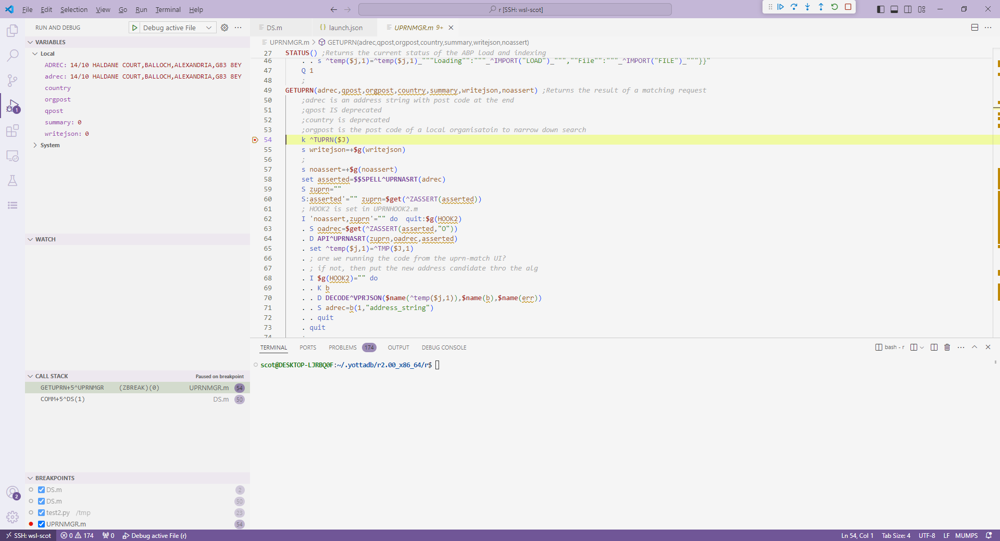
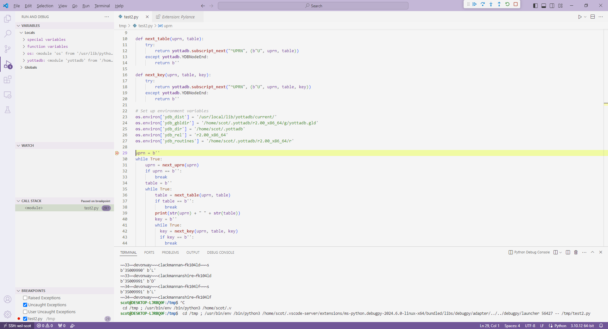

# Using VS Code to run and debug your Mumps and Python code

I've been debugging and running the mumps and python code in Visual Studio Code (VS Code).

The mumps extension I've been using is called the Mumps Language-Pack.

The extension id of the mumps language-pack is jewuma.mumps-debug.

https://github.com/jewuma/mumps-debug is the github repository where the mumps language-pack extensions source code can be found.

The python extension is called Pylance, and the extension was written by Microsoft.

You can find examples of Python software that accesses the Mumps/YottaDB database in the python folder.

Mumps extension:

Python extension:
